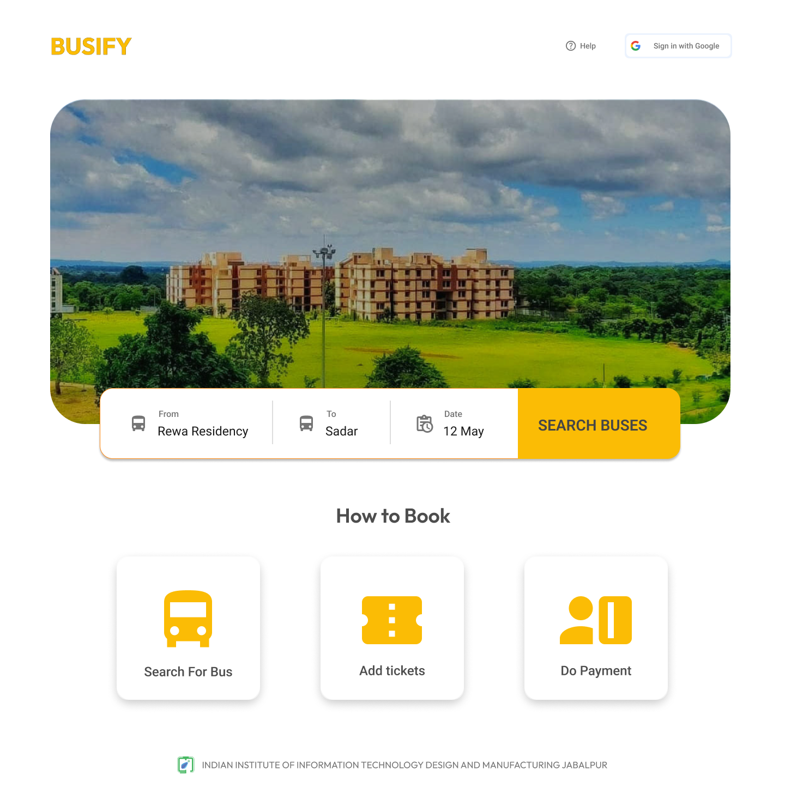
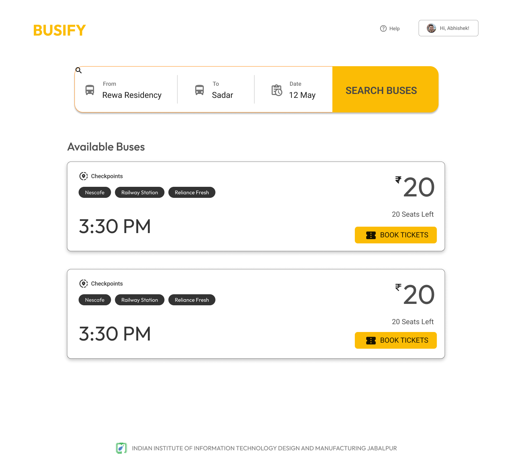

# Busify-Ticket Booking System

A centralised bus ticket booking system that will allow the students to book tickets in advance through an online website, saving time and effort. Students will no longer need to physically stand in long queues to purchase tickets.

The ticket booking system will provide a user-friendly interface where passengers can search for available routes, select their desired travel date and time and make secure online payments.

# Features

The proposed plan is to develop a bus ticket booking system consisting of the folowing:

- to search for buses,
- add tickets to their cart, make payments, and
- provides authentication and payment services,
- authenticate using college email IDs,
- QR code scanner,
- a list of booked tickets.
- Generates QR codes for confirmed tickets,
- sends email notifications with QR codes.

In summary, the plan involves developing a user-friendly bus ticket booking system with a client app, centralized server, notification microservice, admin panel, and mobile app for conductors.

# 🔗 Design

[Figma Design](https://www.figma.com/file/DCKxO44wwjeAxmUHLvZ5wT/Busify?type=design&node-id=31%3A208&t=7aXZk7qlTON3A8C3-1)

## Screenshots

</img>
</img>

# Tech Stack

## Frontend

- ReactJS
- TypeScript
- MUI

## Backend

- NestJS
- Postgres
- Redis

# Run Locally

The [Contributing.md](Contributing.md) contains the step-by-step procedure for contributing to this project.

# License

IIITDM Jabalpur
