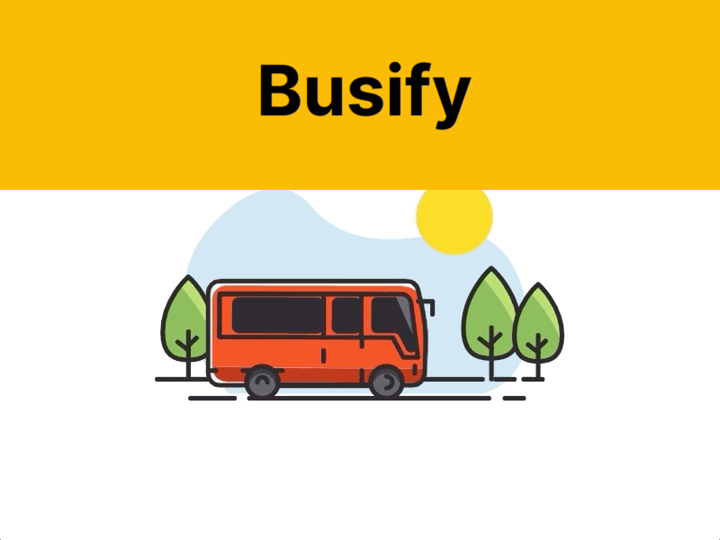

<p align-self="center"></p>

# Busify-Ticket Booking System

A centralised bus ticket booking system that will allow the students to book tickets in advance through an online website, saving time and effort. Students will no longer need to physically stand in long queues to purchase tickets.

The ticket booking system will provide a user-friendly interface where passengers can search for available routes, select their desired travel date and time and make secure online payments.

# Features

The proposed plan is to develop a bus ticket booking system consisting of the

- Client App
- Main Server
- Notification Microservice,
- Admin Panel, and
- Mobile App for Conductors.

### The Client App allows users

- to search for buses,
- authenticate using college email IDs,
- add tickets to their cart, make payments, and
- receive a success message.

### The Main Server handles

- user requests,
- manages communication with microservices and the mobile app,
- provides authentication and payment services,
- and offers admin and ticket management tools.

### The Notification Microservice

- generates QR codes for confirmed tickets,
- extracts student information,
- sends email notifications with QR codes.

The Admin Panel enables bus agencies to update details and view booked tickets.

### The Mobile App for Conductors includes

- QR code scanner,
- ticket validation, and
- a list of booked tickets.

In summary, the plan involves developing a user-friendly bus ticket booking system with a client app, centralized server, notification microservice, admin panel, and mobile app for conductors.

# 🔗 Design

[Figma Design](https://www.figma.com/file/DCKxO44wwjeAxmUHLvZ5wT/Busify?type=design&node-id=31%3A208&t=7aXZk7qlTON3A8C3-1)

## Screenshots

<p align-self="center"></p>

# Roadmap

- Visits the Web App

- Login with institute Email

- Search for the Bus

- Select the Bus

- Add Tickects(Max. 4)

- Notification of successful Booking

- Payment Conformation

- Book The Tickects

# Tech Stack

## Frontend

- ReactJS
- TypeScript :)
- React Router Dom v6
- MUI

# Run Locally

Clone the project

```bash
  git clone https://github.com/bsoc-bitbyte/busify.git
```

Go to the project directory

```bash
  cd Busify.git
```

Install dependencies

```bash
  npm install
```

Start the server

```bash
  npm run start
```

# License

IIITDM Jabalpur
